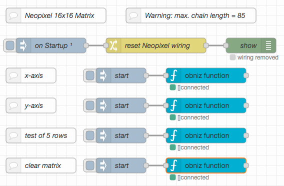

# node-red-obniz-neopixel-matrix-test #

just a few Node-RED flows to test a Neopixel matrix connected to an obniz board

This repository contains a few simple [Node-RED](https://nodered.org/) flows to control an [obniz board](https://obniz.com/products/obnizboard) with an attached Neopixel 16x16 RGB matrix - but they may easily be adapted to other geometries of chained WS2812 RGB LEDs (but only up to a length of 85 LEDs because of restrictions in the obniz board)

While the idea behind the obniz board has its benefits, the quality of software and documentation is...not really optimal - these flows may therefore perhaps help necomers to work with the board and attached WS2812 strings.

> Just a small note: if you like this work and plan to use it, consider "starring" this repository (you will find the "Star" button on the top right of this page), so that I know which of my repositories to take most care of.

## Prerequisites ##

In order to run these examples you will need

* a working Node-RED instance,
* [node-red-contrib-obniz](https://flows.nodered.org/node/node-red-contrib-obniz) - which installs some nodes to communicate with obniz boards,
* an obniz board,
* Internet access (because of the obniz board) and
* any kind of WS2812 RGB LED or string

## Instructions ##

Once you have all the components together, you will have to

* start up (and configure) the obniz board
* connect the WS2812 LED string
* import these flows
* configure the obniz nodes (i.e., enter the credentials of your board) and
* start the flows as desired

### Start-up the Obniz Board ###

### Connect the WS2812 LED String ###

### Import the Flows from this Repo ###

### Configure Obniz Nodes ###

### Run desired Flows ###

This repository contains four different flows. Because of how the obniz board works, they have to share the configured wiring - once set up, it will be stored in the flow context and reused by any other flow (which is why it has to be reset automatically upon re-deployment)

* **x-axis** this flow draws a "x-axis" by lighting the LEDs 0, 1, 2 up to 15
* **y-axis** this flow draws a "y-axis" by lighting the LEDs 0, 16, 32 and so on - this is useful because matrices are usually wired in a serpentine manner
* **test of 5 rows** the initial idea was to write a short function test to see if all matrix LEDs work as intended. This flow tests 5 rows of the connected matrix (because of restrictions in the obniz board) row-wise and alternately in red, green and blue
* **clear matrix** WS2812 LEDs are very bright and may disturb when lighting - this flow therefore switches all LEDs off

## License ##

[MIT License](LICENSE.md)
